# Sapliy Fintech Architecture

**Event-driven automation & policy platform for fintech and business flows**

> A self-hosted alternative to Stripe + Zapier, focused on finance + operations.

---

## Core Mental Model

Everything in Sapliy reduces to **4 core concepts**:

```mermaid
graph TD
    subgraph Organization["🔑 Organization"]
        direction TB
        subgraph ZoneProd["🧩 Zone: Production"]
            direction TB
            P_Events[⚡ Events]
            P_Flows[🔄 Flows]
            P_Events --> P_Flows
        end
        
        subgraph ZoneStaging["🧩 Zone: Staging"]
            direction TB
            S_Events[🧪 Events]
            S_Flows[🔄 Flows]
            S_Events --> S_Flows
        end
    end

    subgraph FlowEngine["⚙️ Execution Engine"]
        Logic{Logic & Rules}
        Approval[👤 Approval]
        Audit[📝 Audit]
    end

    subgraph Outputs["📤 Actions & Ledger"]
        Ledger[(💰 Ledger)]
        Webhook[🌐 Webhook]
        Notify[✉️ Notify]
    end

    P_Flows --> Logic
    S_Flows --> Logic
    
    Logic --> Approval
    Approval --> Audit
    Audit --> Webhook
    Audit --> Notify
    Audit --> Ledger

    classDef zone fill:#f9f9f9,stroke:#333,stroke-width:1px;
    class ZoneProd,ZoneStaging zone;
```



### 🔑 Organization
- Owns everything
- Has users, teams, policies
- Root of all access control

### 🧩 Zone
**The key abstraction.** A zone is an isolated automation space combining:
- `sapliy_secret_key` (server-side)
- `sapliy_publishable_key` (client-side)
- **Mode**: `test` | `live`
- Flows, Events, Logs

Think: *Stripe Account + Webhook Endpoint combined*

### ⚡ Event
Everything is an event:
- From SDK (`sapliy.emit("checkout.clicked", {...})`)
- From UI interactions
- From external providers (Stripe, payment gateways)
- From the gateway itself

**No event → nothing happens.**

### 🔄 Flow (Automation)
Flows listen to:
- Event type
- Zone

Then execute:
- Logic (conditions, filters, approvals)
- Actions (webhooks, notifications, audit logs)
- Policy checks

**This is the core value proposition.**

---

## Repository Responsibility Matrix

| Repository | Purpose | Talks To | Does NOT |
|------------|---------|----------|----------|
| **fintech-ecosystem** | The brain: auth, orgs, zones, keys, events, flows, ledger, policy engine | PostgreSQL, Kafka, Redis, RabbitMQ | Care about UI, SDK language
| **fintech-sdk-node** | Node.js SDK: emit events, verify signatures, retry, test/live mode | fintech-ecosystem API | Contain business logic or flow execution |
| **fintech-sdk-go** | Go SDK: same as Node | fintech-ecosystem API | Contain business logic or flow execution |
| **fintech-sdk-python** | Python SDK: same as Node | fintech-ecosystem API | Contain business logic or flow execution |
| **fintech-ui** | React components: checkout, payment forms, dashboards | Uses publishable_key only | Execute logic, hold secrets, admin actions |
| **fintech-automation** | Flow Builder UI: visual automation editor | fintech-ecosystem only | Execute logic, talk directly to SDK users |
| **sapliy-cli** | Developer CLI: login, listen, trigger, debug | fintech-ecosystem WebSocket | Hold state, execute production logic |
| **fintech-docs** | Documentation site | Static content | — |

---

## System Architecture


---

## Zone & Key Model

Every zone operates in two modes with separate isolation:

| | Test Mode | Live Mode |
|--|-----------|-----------|
| **Secret Key** | `sk_test_...` | `sk_live_...` |
| **Publishable Key** | `pk_test_...` | `pk_live_...` |
| **Logs** | Separate | Separate |
| **Flows** | Can be shared or separate | Can be shared or separate |
| **Events** | Test events only | Production events |

**This reduces fear for companies to experiment without risking production.**

---

## Security Model

### Webhook Security
All webhooks include:
- **Signature header**: HMAC-SHA256
- **Event ID**: Idempotency
- **Zone ID**: Context
- **Timestamp**: Replay protection

```http
POST /webhook HTTP/1.1
X-Sapliy-Signature: sha256=abc123...
X-Sapliy-Event-ID: evt_123
X-Sapliy-Zone-ID: zone_456
X-Sapliy-Timestamp: 1706972400
```

### API Key Scopes
Keys can be scoped to specific operations:
- `events:emit` — Send events
- `flows:read` — View flows
- `flows:write` — Create/edit flows
- `admin:*` — Full access

---

## Policy-Based Access Control (PBAC)

### Phase 1: Hardcoded Policies (Current)
```
- "Who can create zones" → Admin only
- "Who can deploy live flows" → Admin + Finance
```

### Phase 2: Simple JSON Policies
```json
{
  "allow": ["flow.deploy"],
  "when": { "role": "admin" }
}
```

### Phase 3: Full Policy Engine (Future)
OPA-style policy language for complex rules.

---

## Monetization Strategy

| Tier | Features | Price |
|------|----------|-------|
| **Free** | 1 zone, 1K events/month | $0 |
| **Starter** | 3 zones, 10K events | $29/mo |
| **Pro** | Unlimited zones, 100K events | $99/mo |
| **Enterprise** | Custom, SLA, compliance | Contact |

Revenue drivers:
- Zone count
- Event volume
- Notifications (WhatsApp, SMS)
- Third-party plugins
- Hosted execution
- SLA guarantees

---

## Getting Started

1. **Run the ecosystem**: `docker-compose up -d` in `fintech-ecosystem`
2. **Create a zone**: Use the API or Flow Builder UI
3. **Install SDK**: `npm install @sapliyio/fintech`
4. **Emit events**: `sapliy.emit("checkout.completed", { amount: 100 })`
5. **Build flows**: Use the Flow Builder to react to events

---

## Related Repositories

- [fintech-ecosystem](https://github.com/sapliy/fintech-ecosystem) — Core backend services
- [fintech-sdk-node](https://github.com/sapliy/fintech-sdk-node) — Node.js SDK
- [fintech-sdk-go](https://github.com/sapliy/fintech-sdk-go) — Go SDK
- [fintech-sdk-python](https://github.com/sapliy/fintech-sdk-python) — Python SDK
- [fintech-ui](https://github.com/sapliy/fintech-ui) — React components
- [fintech-automation](https://github.com/sapliy/fintech-automation) — Flow Builder UI
- [sapliy-cli](https://github.com/sapliy/sapliy-cli) — Developer CLI
- [fintech-docs](https://github.com/sapliy/fintech-docs) — Documentation site

---

## License

MIT © [Sapliy](https://github.com/sapliy)
