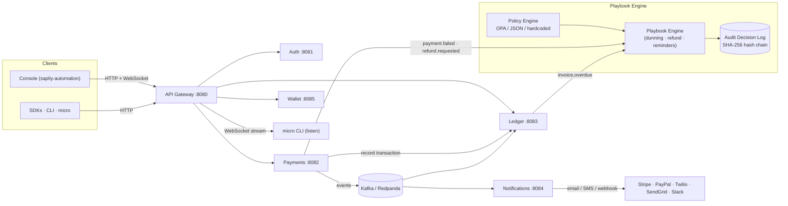

```
  ███████  █████  ██████  ██      ██ ██   ██
  ██      ██   ██ ██   ██ ██      ██ ██  ██
  ███████ ███████ ██████  ██      ██ █████
       ██ ██   ██ ██      ██      ██ ██  ██
  ███████ ██   ██ ██      ███████ ██ ██   ██
═══════════════════════════════════════════════
  SAPLIY ECOSYSTEM · CORE BACKEND
  API Gateway · Payments · Ledger · Wallets
  Playbook Engine · Policy Engine · Audit Log
═══════════════════════════════════════════════
```

**Sapliy is an AI-native Financial Operations Intelligence Layer that turns business goals into reliable, explainable, auditable financial outcomes — by orchestrating the systems companies already run (Stripe, PayPal, Paddle, HubSpot, Xero), not replacing them.**

[](https://opensource.org/licenses/MIT)
[](https://go.dev/)
[](https://github.com/Sapliy/sapliy-ecosystem)
[](https://github.com/Sapliy/sapliy-ecosystem)

---

## What is this?

This repository is the **core backend** of the Sapliy platform: an API gateway in front of payments, ledger, wallet, billing, notification, and flow microservices, plus the **Playbook Engine** (`internal/playbook`) that runs Sapliy's Operational Playbooks. It is an autonomation layer — not a workflow builder and not a payment processor. The engine consumes unified financial events (`payment.failed`, `refund.requested`, `invoice.overdue`) from any connected provider, applies deterministic policy gates, schedules actions, and records every decision in an immutable, hash-chained **Audit Decision Log** so any outcome can be replayed and audited.

The Go module is `github.com/sapliy/sapliy-core`; the repository lives at [`github.com/Sapliy/sapliy-ecosystem`](https://github.com/Sapliy/sapliy-ecosystem).

---

## Key features

- 🧠 **Playbook Engine** — in-process state machine that runs the three MVP Operational Playbooks with retry scheduling, policy gates, and decision logging (`internal/playbook`).
- 🔒 **Immutable Audit Decision Log** — append-only, SHA-256 hash-chained log storing action + reason + policy applied + AI reasoning; tamper detection via `Verify()`.
- ⚖️ **Deterministic Policy Engine** — OPA/Rego policies with JSON and hardcoded fallbacks (`internal/policy`), so no money moves without a rule check.
- 💰 **Fixed-point money** — every amount is an `int64` cents value; never floats.
- 📒 **Double-entry ledger** — balances are derived from immutable ledger entries; no direct balance updates.
- 🌐 **Unified Financial Event model** — provider-agnostic normalization for Stripe and PayPal webhooks (`NormalizeProviderEvent`).
- 🔌 **Reliable webhooks** — signed, retryable delivery (`payment.succeeded`, etc.) and local testing via the bundled `micro` CLI.
- 🚢 **Containerized stack** — Docker Compose with PostgreSQL, Redis, Redpanda (Kafka), RabbitMQ, Prometheus, Loki, and Grafana; Kubernetes/Helm charts in `deploy/`.

---

## Quickstart

### 1. Clone and build

```bash
git clone https://github.com/Sapliy/sapliy-ecosystem.git
cd sapliy-ecosystem

# Build every service binary into ./bin (Makefile)
make build

# Or build an individual command, e.g. the playbook demo
GOWORK=off go build ./cmd/playbook
```

### 2. Run the full stack

```bash
make up          # docker-compose up --build -d
```

The **API Gateway** is available at `http://localhost:8080`; individual services listen on their own ports (see [API surface](#api-surface)). For logs: `make logs`. To tear down: `make down`.

### 3. Create an account and API key

```bash
# Register
curl -s -X POST http://localhost:8080/v1/auth/register \
  -H "Content-Type: application/json" \
  -d '{"email":"dev@example.com","password":"YourSecurePassword"}'

# Login (get JWT)
curl -s -X POST http://localhost:8080/v1/auth/login \
  -H "Content-Type: application/json" \
  -d '{"email":"dev@example.com","password":"YourSecurePassword"}'

# Create an API key (use the JWT from login in the Authorization header)
curl -s -X POST http://localhost:8080/auth/api_keys \
  -H "Content-Type: application/json" \
  -H "Authorization: Bearer <YOUR_JWT>" \
  -d '{"name":"My key","environment":"test"}'
```

Save the returned `sk_test_...` key for the next steps.

### 4. Create a ledger account and a payment intent

```bash
# Create a ledger account to hold balances
curl -s -X POST http://localhost:8080/v1/ledger/accounts \
  -H "Content-Type: application/json" \
  -H "Authorization: Bearer <sk_test_...>" \
  -d '{"name":"Merchant main","type":"liability","currency":"USD"}'

# Create a payment intent (amount in cents)
curl -s -X POST http://localhost:8080/v1/payments/intents \
  -H "Content-Type: application/json" \
  -H "Authorization: Bearer <sk_test_...>" \
  -H "X-Zone-ID: <zone_id>" \
  -d '{"amount":1000,"currency":"USD","description":"Order #123"}'

# Confirm it
curl -s -X POST "http://localhost:8080/v1/payments/intents/INTENT_ID/confirm" \
  -H "Authorization: Bearer <sk_test_...>" \
  -H "X-Zone-ID: <zone_id>"
```

Confirming a payment creates ledger entries and events; the account balance is derived from the ledger, never updated directly.

### 5. Listen to webhooks locally (no tunnel)

```bash
go build -o micro ./cmd/cli
./micro login                # authenticate against the gateway
./micro listen --forward-to http://localhost:4242/webhook
```

### 6. Run the Playbook Engine

The engine is pure Go with no external runtime. Build and run the demo binary to watch a full dunning → refund-approval → invoice-reminder sequence, then verify the hash-chained decision log:

```bash
GOWORK=off go build ./cmd/playbook
./playbook                  # emits the decision log as JSON, chain verified

# Run the full playbook test suite
GOWORK=off go test ./internal/playbook/...
```

The demo reads `SAPLIY_MAX_RETRIES`, `SAPLIY_FIRST_RETRY_DELAY_H`, `SAPLIY_RETRY_STEP_DELAY_H`, `SAPLIY_FINAL_RETRY_DELAY_H`, `SAPLIY_CHANNELS`, and `SAPLIY_MAGIC_LINK` to override the default dunning schedule.

---

## Architecture / How it works

The system is event-driven. An API gateway fronts the HTTP surface; services talk over gRPC internally, and Kafka (Redpanda) plus RabbitMQ carry async work.


```mermaid
flowchart LR
    subgraph Clients["Clients"]
        Console["Console (sapliy-automation)"]
        SDK["SDKs · CLI · micro"]
    end

    Console -->|HTTP + WebSocket| GW["API Gateway :8080"]
    SDK -->|HTTP| GW

    GW --> Auth["Auth :8081"]
    GW --> Pay["Payments :8082"]
    GW --> Led["Ledger :8083"]
    GW --> Wlt["Wallet :8085"]

    Pay -->|"record transaction"| Led

    subgraph PB["Playbook Engine"]
        Engine["Playbook Engine<br/>(dunning · refund · reminders)"]
        Pol["Policy Engine<br/>OPA / JSON / hardcoded"] --> Engine
        Engine --> ADL[("Audit Decision Log<br/>SHA-256 hash chain")]
    end

    Pay -->|"payment.failed · refund.requested"| Engine
    Led -->|"invoice.overdue"| Engine

    Pay -->|events| K[("Kafka / Redpanda")]
    K --> Notif["Notifications :8084"]
    K --> Led
    Notif -->|"email / SMS / webhook"| Providers["Stripe · PayPal · Twilio · SendGrid · Slack"]

    GW -->|WebSocket stream| Cli["micro CLI (listen)"]
```

**Service map**

| Service | Port | Role |
|---------|------|------|
| **Gateway** | 8080 | Single entry point: API-key validation, proxying, WebSocket event streaming |
| **Auth** | 8081 | API keys, JWT, OAuth2/OIDC; gRPC key validation for other services |
| **Payments** | 8082 | Payment intents + confirmation; emits events to Kafka/Redis; never mutates balances |
| **Ledger** | 8083 | Double-entry accounting; consumes payment events from Kafka for audit |
| **Wallet** | 8085 | High-level view over ledger accounts (top-ups, payouts) |
| **Events** | 8089 | Event stream API for consoles and SDKs |
| **Flow service / runner** | 8088 | Flow definitions and durable execution |
| **Notifications** | 8084 | RabbitMQ worker for email/SMS/webhook delivery |

### API surface

Use the **Gateway** at `:8080` for all HTTP calls and send `Authorization: Bearer sk_...` for Payments and Ledger. Endpoints may be addressed with or without the `/v1` prefix (the gateway normalizes both).

| Service | Key endpoints |
|---------|---------------|
| Auth | `POST /v1/auth/register` · `POST /v1/auth/login` · `POST /v1/auth/validate` |
| Payments | `POST /v1/payments/intents` · `POST /v1/payments/intents/:id/confirm` · `GET /v1/payments/:id` |
| Ledger | `POST /v1/ledger/accounts` · `GET /v1/ledger/accounts/:id` · `POST /v1/ledger/transactions` |

### Core primitives

| Primitive | What it does |
|-----------|--------------|
| **Payments** | Payment intents, confirmations, and status. No direct balance updates — all money movement goes through the ledger. |
| **Transaction Ledger** | Double-entry accounting: accounts, entries, balances. Single source of truth for financial state. |
| **Wallets** | Logic layer over the ledger for user balances, top-ups, and payouts with metadata. |
| **Webhooks** | Reliable event delivery (`payment.succeeded`, …) with retries, signing, and local testing via the CLI. |

---

## Operational Playbooks

The Playbook Engine runs the three MVP playbooks on top of the unified financial event model:

| Playbook | Event | Default policy |
|----------|-------|----------------|
| **Revenue Recovery & Dunning** | `payment.failed` | Retry at ~5h, then stepping 48h (days 3/5/7), max 4 attempts; magic-link recovery; terminal outcomes (`hard_decline`, `fraud_block`) escalate immediately |
| **Refund Approval Orchestration** | `refund.requested` | Auto-approve under $1,000 · manager approval over $1,000 (or after day 90) · reject outside the 90-day window |
| **Invoice Reminders** | `invoice.overdue` | Reminders start 3 days before due, then every 7 days, up to 4 reminders via email |

Every decision is appended to the decision log with the *action*, *reason*, *policy applied*, and *AI reasoning* — and the chain is verified end-to-end by the engine before it is emitted.

---

## Project structure

```
cmd/          # Service entrypoints (auth, payments, ledger, wallet, gateway,
              #   events, flow-service, flow-runner, notifications, fraud,
              #   reconciler, connect, cli, playbook)
internal/     # Domain + infra
  auth/       #   authentication & keys
  payment/    #   payment intents & confirmation
  ledger/     #   double-entry accounting
  wallet/     #   wallet logic over the ledger
  notification/ # email/SMS/webhook delivery
  flow/       #   flow definitions & execution
  playbook/   #   engine, policies, retry schedule, audit chain
  policy/     #   OPA / JSON / hardcoded policy evaluation
  integrations/ # provider normalization (Stripe, PayPal)
pkg/          # Shared libs (jwt, apikey, db, messaging, observability, …)
proto/        # gRPC + API definitions
migrations/   # Per-service SQL migrations
deploy/       # Docker Compose, Kubernetes, Helm charts, Grafana
config/       # policies.rego, policies.json, service configs
examples/     # integration examples
```

---

## Official SDKs

Auto-generated, type-safe clients for the gateway API:

| SDK | Install | Notes |
|-----|---------|-------|
| **Go** | `go get github.com/sapliy/sapliy-sdk-go` | Hand-written service wrappers + generated OpenAPI client |
| **Node.js** | `npm install @sapliyio/fintech` | *(legacy package name — published as `@sapliyio/fintech`)* |
| **Python** | `pip install sapliyio-fintech` | *(legacy package name — published as `sapliyio-fintech` / `sapliyio_fintech`)* |

See the [examples/](https://github.com/Sapliy/sapliy-ecosystem/tree/main/examples) directory for real-world integration guides (e-commerce checkout, financial auditing, dunning).

---

## Development

```bash
make build           # build all service binaries into ./bin
make test            # run tests across services (see PKGS in Makefile)
make test-aggressive # tests with -race and no cache
make fmt             # gofmt the service packages
make lint            # golangci-lint
make proto           # regenerate code from .proto files
make setup-hooks     # install the repo's git hooks
```

- **Tests** — the Playbook Engine ships 19 unit tests covering retry scheduling, refund policy gates, event normalization, audit-chain integrity/tamper detection, and the engine state machine.
- **Contributing** — see [`CONTRIBUTING.md`](CONTRIBUTING.md) for commit style and PR guidance; the roadmap lives in [`ROADMAP.md`](ROADMAP.md).
- **Builds** — run with `GOWORK=off` when working inside a multi-repo workspace to avoid cross-module interference.

---

## License

MIT. See [LICENSE](LICENSE).

## Links

- Docs — Sapliy documentation site (`/concepts/architecture`, `/playbooks/*`)
- GitHub — [github.com/Sapliy](https://github.com/Sapliy)
- Related repos — [sapliy-automation](https://github.com/Sapliy/sapliy-automation) (console) · [sapliy-sdk-go](https://github.com/Sapliy/sapliy-sdk-go) · [sapliy-sdk-node](https://github.com/Sapliy/sapliy-sdk-node) · [sapliy-sdk-python](https://github.com/Sapliy/sapliy-sdk-python) · [sapliy-cli](https://github.com/Sapliy/sapliy-cli) · [sapliy-integrations](https://github.com/Sapliy/sapliy-integrations)