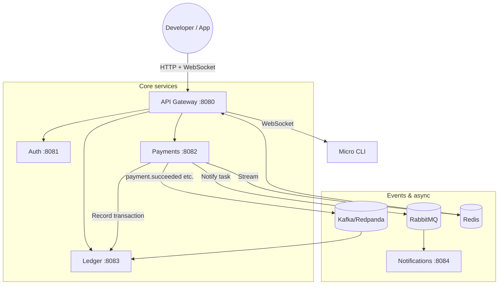

# Sapliy Fintech Ecosystem

**Open-source financial infrastructure** — a self-hosted alternative to Stripe. Run payments, ledgers, and webhooks on your own infrastructure with a clear, minimal scope and production-ready primitives.
Developed by **Sapliy**, this ecosystem provides the building blocks for modern fintech applications.

---

## Scope: Core Primitives

We focus on **three core fintech primitives** so the project stays understandable and maintainable:

| Primitive | What it does |
|-----------|--------------|
| **Payments** | Payment intents, confirmations, and status. No direct balance updates — all money movement goes through the ledger. |
| **Transaction Ledger** | Double-entry accounting: accounts, entries, and balances. Single source of truth for all financial state. |
| **Wallets** | Logic layer over the ledger for managing user balances, top-ups, and payouts with metadata. |
| **Webhooks** | Reliable event delivery (e.g. `payment.succeeded`) with retries, signing, and local testing via the CLI. |

**Design rule:** Balances are never updated directly. Every movement is a ledger transaction (double-entry), so you get auditability and correctness by default.

---

## Architecture Overview

The system is **event-driven**: an API Gateway fronts HTTP; services talk over gRPC where needed; Kafka/Redpanda and RabbitMQ handle events and async work.



- **API Gateway** — Single entry point: validates API keys (via Auth), proxies to Payments/Ledger, streams webhook events over WebSocket for the CLI.
- **Auth** — API keys, OAuth2/OIDC, scopes. gRPC for internal key validation.
- **Payments** — Payment intents and confirmation. Produces events to Kafka and Redis; never mutates balances directly — delegates to Ledger.
- **Ledger** — Double-entry ledger: accounts, transactions, entries. Consumes payment events from Kafka for audit; exposes gRPC/HTTP for balance and history.
- **Notifications** — Async worker (RabbitMQ) for email/SMS and webhook delivery.
- **Micro CLI** — Login, webhook listening (`micro listen`), local dev workflow.

---

## Example Use Cases

1. **SaaS checkout** — Create a payment intent via API, confirm on your frontend, receive `payment.succeeded` via webhook; your backend credits the merchant’s ledger account (no direct balance update).
2. **Marketplace / Connect** — Split fees between platform, developer, and merchant. Use Ledger accounts per party; Payments + Ledger record exactly who gets what.
3. **User Wallets** — “Wallets” are high-level views of Ledger accounts. Top-ups and payouts are recorded as ledger transactions; the balance is derived from the immutable entry log.
4. **Compliance and Audit** — Every movement produces a permanent ledger entry. You can replay the entire history of any account to reconcile state or pass audits.

---

## Quick Start

### 1. Run the stack

```bash
git clone https://github.com/Sapliy/fintech-ecosystem.git
cd fintech-ecosystem
docker-compose up --build -d
```

Gateway: `http://localhost:8080`.

### 2. Create an account and API key

```bash
# Register
curl -s -X POST http://localhost:8080/auth/register \
  -H "Content-Type: application/json" \
  -d '{"email":"dev@example.com","password":"YourSecurePassword"}'

# Login (get JWT)
curl -s -X POST http://localhost:8080/auth/login \
  -H "Content-Type: application/json" \
  -d '{"email":"dev@example.com","password":"YourSecurePassword"}'

# Create an API key (use the JWT from login in Authorization header)
curl -s -X POST http://localhost:8080/auth/api_keys \
  -H "Content-Type: application/json" \
  -H "Authorization: Bearer <YOUR_JWT>" \
  -d '{"name":"My key","environment":"test"}' 
```

Save the returned `sk_test_...` (or `sk_live_...`) for the next steps.

### 3. Create a ledger account (balance holder)

```bash
curl -s -X POST http://localhost:8080/ledger/accounts \
  -H "Content-Type: application/json" \
  -H "Authorization: Bearer <sk_test_...>" \
  -d '{"name":"Merchant main","type":"liability","currency":"USD"}'
```

Use the returned `id` as the account that will receive funds.

### 4. Create and confirm a payment intent

```bash
# Create intent
curl -s -X POST http://localhost:8080/payments/payment_intents \
  -H "Content-Type: application/json" \
  -H "Authorization: Bearer <sk_test_...>" \
  -d '{"amount":1000,"currency":"USD","description":"Order #123"}'

# Confirm (use the intent id from previous response)
curl -s -X POST "http://localhost:8080/payments/payment_intents/INTENT_ID/confirm" \
  -H "Authorization: Bearer <sk_test_...>"
```

Confirming a payment will create ledger entries (and events); the balance for the linked account comes from the ledger, not from a direct update.

### 5. Listen for webhooks locally (no tunnel)

```bash
go build -o micro ./cmd/cli
./micro login   # authenticate with the same gateway
./micro listen --forward-to http://localhost:4242/webhook
```

Trigger a payment confirmation; you’ll see `payment.succeeded` (and related events) in the CLI and optionally forwarded to your local server.

---

## API Reference (summary)

| Service | Port | Key endpoints |
|---------|------|----------------|
| **Auth** | 8081 | `POST /auth/register`, `POST /auth/login`, `POST /auth/api_keys` |
| **Payments** | 8082 | `POST /payments/payment_intents`, `POST /payments/payment_intents/:id/confirm` |
| **Ledger** | 8083 | `POST /ledger/accounts`, `GET /ledger/accounts/:id`, `POST /ledger/transactions` |

Use **Gateway** at `:8080` for all HTTP calls; send `Authorization: Bearer sk_...` for Payments and Ledger.

---

## Tech Stack

- **Go** 1.24+
- **gRPC** and **Protocol Buffers** for internal APIs
- **PostgreSQL** (one DB per service)
- **Kafka (Redpanda)** for event sourcing and audit
- **RabbitMQ** for async jobs (e.g. notifications)
- **Redis** for real-time webhook streaming to the CLI
- **Docker Compose** and **Kubernetes/Helm** for deployment

---

## Project layout (high level)

```
cmd/          # Service entrypoints (auth, payments, ledger, gateway, notifications, cli, …)
internal/     # Domain and infra (payment, ledger, notification, auth, …)
pkg/          # Shared libs (jwt, db, messaging, monitoring)
proto/        # gRPC and API definitions
deploy/       # K8s and Helm
migrations/   # Per-service SQL migrations
```

---

## Roadmap and contributing

- **Roadmap** — Quality (tests, idempotency, layering), growth, and a path to hosted/paid offerings: [ROADMAP.md](ROADMAP.md).
- **Contributing** — Good first issues, commit style, and how to run tests: [CONTRIBUTING.md](CONTRIBUTING.md).

---

## License

MIT. See [LICENSE](LICENSE).
